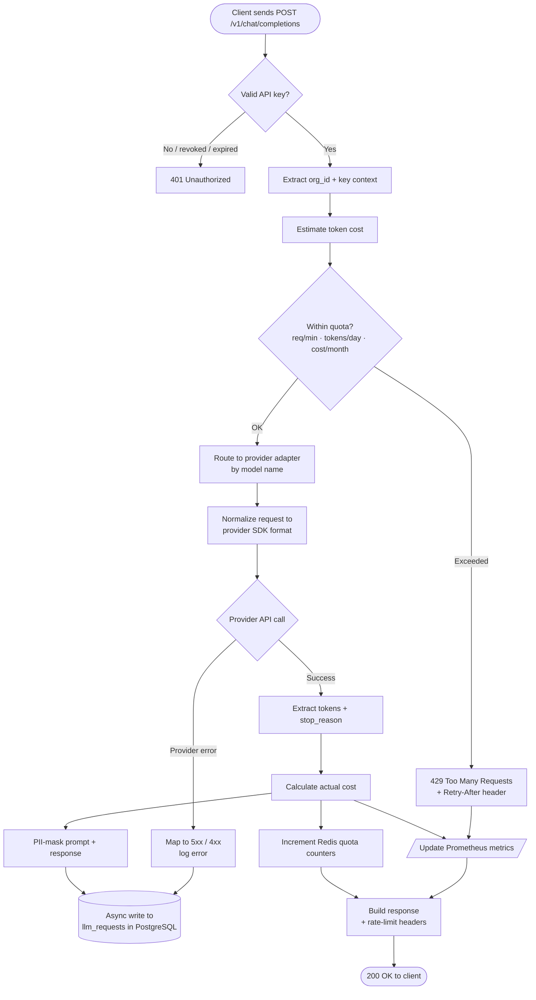
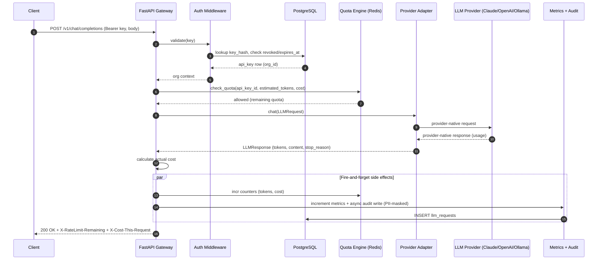
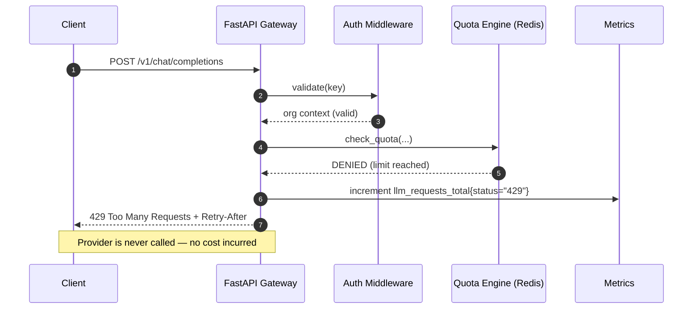
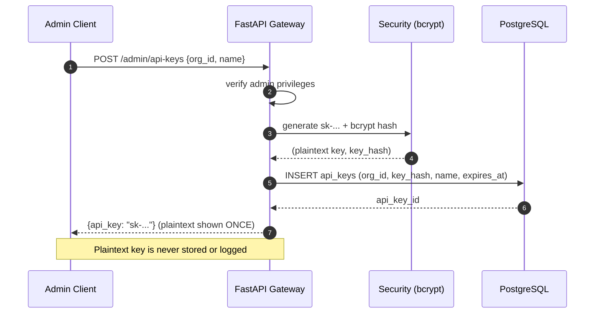

# LLMController: AI Provisioning & Cost Governance Platform

**Project Scope:** High-Level Design (HLD) + Low-Level Design (LLD)  
**Target Role:** AI Platform Engineer at Scalable Capital  
**Tech Stack:** FastAPI (Python), PostgreSQL, Redis, AWS (ECS + RDS), Terraform, Docker

---

## Table of Contents

1. [Project Overview](#project-overview)
2. [High-Level Design (HLD)](#high-level-design-hld)
3. [Low-Level Design (LLD)](#low-level-design-lld)
4. [Implementation Roadmap](#implementation-roadmap)
5. [Success Criteria](#success-criteria)

---

## Project Overview

**What is LLMController?**

LLMController is an enterprise-grade LLM gateway and cost governance platform. It sits between AI applications and multiple LLM providers (Claude, OpenAI, local models), enforcing:
- **Unified access** to heterogeneous LLM APIs
- **Cost tracking & budgeting** with real-time alerts
- **Rate limiting & quotas** (per-user, per-team, per-model)
- **Observability & audit trails** via structured logging
- **Security & data privacy** (PII masking, access control)

**Why Build This?**

Directly addresses 5 of 5 core responsibilities in the Scalable Capital AI Platform Engineer role:
1. Develop and maintain internal AI provisioning platform (LiteLLM-like)
2. Implement comprehensive LLM observability, logging, and alerting
3. Enforce model governance, security, and cost management
4. Support cloud-native architectures (AWS, Terraform, containerized)
5. Build infrastructure for monitoring production AI systems

---

## High-Level Design (HLD)

### System Architecture Overview

```
┌─────────────────────────────────────────────────────────────────┐
│                    AI Applications / Clients                      │
└────────────────────────────┬────────────────────────────────────┘
                             │
                    ┌────────▼────────┐
                    │  LLMController  │
                    │   API Gateway   │
                    │   (FastAPI)     │
                    └────────┬────────┘
                             │
        ┌────────────────────┼────────────────────┐
        ▼                    ▼                    ▼
   Claude Adapter      OpenAI Adapter       Ollama Adapter

┌─────────────────────────────────────────────────────────────────┐
│                   Core Services                                  │
├─────────────────────────────────────────────────────────────────┤
│  Auth & API Key Mgmt  │  Rate Limiting (Redis)                  │
│  Cost Calc (PG)       │  Audit Logging (PG)                     │
│  Prometheus Metrics   │  PII Masking                            │
└─────────────────────────────────────────────────────────────────┘

┌─────────────────────────────────────────────────────────────────┐
│                   AWS Deployment (Terraform)                     │
├─────────────────────────────────────────────────────────────────┤
│  ECS Fargate | RDS PostgreSQL | ElastiCache Redis               │
│  ALB | ECR | CloudWatch                                         │
└─────────────────────────────────────────────────────────────────┘
```

### Key Components

#### 1. API Gateway Layer (FastAPI)
Entry point for all LLM requests. Validates, routes to provider adapters, returns normalized responses.

#### 2. Authentication & Authorization
- API keys hashed with bcrypt (never stored plaintext)
- Keys mapped to organizations/teams with expiration and last-used tracking
- Middleware extracts org context for audit trail

#### 3. Provider Adapter Layer
Abstract `LLMProvider` base class with concrete adapters for Claude, OpenAI, and Ollama. Normalizes request/response formats and handles provider-specific errors.

#### 4. Rate Limiting & Quota Engine
Redis-backed **fixed window** counters enforcing:
- Tokens per day
- Requests per minute
- Cost per month
- Per-model quotas

Each counter uses `SETEX` with a TTL matching the window (60s, 86400s, 2592000s). Fixed window is simpler to implement and sufficient for governance use cases; sliding window can be added later if burst behavior near window boundaries becomes a problem.

Returns 429 with `Retry-After` header when exceeded.

#### 5. Cost Calculation & Tracking
Static pricing tables per model. Formula:
```
cost = (input_tokens / 1000 * input_price_per_1k) + (output_tokens / 1000 * output_price_per_1k)
```
Costs estimated before request (for quota pre-validation) and recorded after response.

#### 6. Request/Response Logging & Audit
Async writes to PostgreSQL (fire-and-forget, does not block request path). Logs: request ID, API key ID, model, provider, tokens, cost, latency, status code, masked prompt/response.

#### 7. Observability & Metrics
Prometheus metrics:
- `llm_requests_total` — counter [model, provider, status]
- `llm_tokens_total` — counter [model, direction]
- `llm_cost_total_usd` — counter [model, org_id]
- `llm_request_duration_seconds` — histogram [model, provider]
- `llm_quota_usage_ratio` — gauge [api_key_id, quota_type]

Alerts: cost spikes, quota > 80%, error rate > 5%.

#### 8. Security & Data Privacy
- API keys hashed with bcrypt; usage audited per request
- PII masking: regex-based detection of emails, phones, SSNs, credit cards
- Access control: orgs see only their own data; admin APIs require elevated permissions

### Data Flow

```
POST /v1/chat/completions
  → Auth middleware (hash & lookup key)
  → Rate limit check (Redis)
  → Provider routing
  → Claude/OpenAI/Ollama API call
  → Response processing (extract tokens + calculate cost)
  → Async log to PostgreSQL (fire-and-forget)
  → Prometheus metrics update
  → Return to client with rate-limit headers
```

### Workflow Diagram (Request Lifecycle)

End-to-end decision flow for a chat completion request, including the rejection paths.



### Sequence Diagram — Chat Completion (Happy Path)



### Sequence Diagram — Quota Exceeded (Rejection Path)



### Sequence Diagram — Admin: Create API Key



---

## Low-Level Design (LLD)

### Database Schema

```sql
CREATE TABLE organizations (
  id UUID PRIMARY KEY DEFAULT gen_random_uuid(),
  name VARCHAR(255) NOT NULL,
  created_at TIMESTAMP DEFAULT CURRENT_TIMESTAMP,
  updated_at TIMESTAMP DEFAULT CURRENT_TIMESTAMP
);

CREATE TABLE api_keys (
  id UUID PRIMARY KEY DEFAULT gen_random_uuid(),
  org_id UUID NOT NULL REFERENCES organizations(id) ON DELETE CASCADE,
  key_hash VARCHAR(255) UNIQUE NOT NULL,
  name VARCHAR(255),
  created_at TIMESTAMP DEFAULT CURRENT_TIMESTAMP,
  last_used TIMESTAMP,
  expires_at TIMESTAMP,
  revoked BOOLEAN DEFAULT FALSE
);
CREATE INDEX idx_api_keys_org_id ON api_keys(org_id);

CREATE TABLE llm_requests (
  id UUID PRIMARY KEY DEFAULT gen_random_uuid(),
  api_key_id UUID NOT NULL REFERENCES api_keys(id),
  org_id UUID NOT NULL,
  model VARCHAR(100) NOT NULL,
  provider VARCHAR(50) NOT NULL,
  prompt_tokens INT,
  completion_tokens INT,
  total_tokens INT,
  estimated_cost DECIMAL(12, 8),
  actual_cost DECIMAL(12, 8),
  latency_ms INT,
  status_code INT,
  error_message TEXT,
  masked_prompt TEXT,
  masked_response TEXT,
  request_id UUID,
  created_at TIMESTAMP DEFAULT CURRENT_TIMESTAMP
);
CREATE INDEX idx_llm_requests_api_key_id ON llm_requests(api_key_id, created_at);
CREATE INDEX idx_llm_requests_org_id ON llm_requests(org_id, created_at);
CREATE INDEX idx_llm_requests_model ON llm_requests(model, created_at);

CREATE TABLE quotas (
  id UUID PRIMARY KEY DEFAULT gen_random_uuid(),
  org_id UUID NOT NULL REFERENCES organizations(id) ON DELETE CASCADE,
  api_key_id UUID,
  model VARCHAR(100),
  quota_type VARCHAR(50) NOT NULL,
  limit_value INT NOT NULL,
  reset_at TIMESTAMP,
  created_at TIMESTAMP DEFAULT CURRENT_TIMESTAMP,
  updated_at TIMESTAMP DEFAULT CURRENT_TIMESTAMP
);

CREATE TABLE quota_usage (
  id UUID PRIMARY KEY DEFAULT gen_random_uuid(),
  quota_id UUID NOT NULL REFERENCES quotas(id) ON DELETE CASCADE,
  org_id UUID NOT NULL,
  api_key_id UUID,
  used_value INT NOT NULL DEFAULT 0,
  reset_at TIMESTAMP,
  updated_at TIMESTAMP DEFAULT CURRENT_TIMESTAMP
);

CREATE TABLE daily_costs (
  id UUID PRIMARY KEY DEFAULT gen_random_uuid(),
  org_id UUID NOT NULL REFERENCES organizations(id),
  cost_date DATE NOT NULL,
  model VARCHAR(100),
  provider VARCHAR(50),
  total_cost DECIMAL(12, 8),
  total_tokens INT,
  request_count INT,
  created_at TIMESTAMP DEFAULT CURRENT_TIMESTAMP,
  UNIQUE (org_id, cost_date, model, provider)
);
```

### API Endpoints

**Client-facing:**
```
POST /v1/chat/completions   Route to Claude/OpenAI/Ollama, enforce quotas
POST /v1/embeddings         Generate embeddings
GET  /v1/models             List available models
GET  /health                Load balancer health check
GET  /metrics               Prometheus metrics
```

**Admin (internal):**
```
POST   /admin/quotas                  Create/update quota for org or key
GET    /admin/usage/:api_key_id       Usage metrics for a key
GET    /admin/costs/report            Cost report (org/date/model grouping)
POST   /admin/api-keys                Create new API key for org
DELETE /admin/api-keys/:api_key_id    Revoke API key
```

### Code Structure

```
llmcontroller/
├── src/llmcontroller/
│   ├── main.py
│   ├── config.py
│   ├── api/           # routes.py, admin.py, models.py
│   ├── auth/          # middleware.py, security.py
│   ├── providers/     # base.py, claude.py, openai.py, ollama.py, factory.py
│   ├── gateway/       # router.py, normalizer.py
│   ├── cost/          # calculator.py, pricing.py
│   ├── quota/         # engine.py, redis_engine.py
│   ├── logging/       # audit.py, masking.py
│   ├── observability/ # metrics.py
│   ├── db/            # models.py, database.py, migrations/
│   ├── cache/         # redis_client.py
│   └── utils/         # errors.py, validators.py
├── tests/
│   ├── unit/
│   └── integration/
├── terraform/
├── docker/
└── .github/workflows/
```

### Key Implementation Patterns

**Provider Adapter:**
```python
class LLMProvider(ABC):
    @abstractmethod
    async def chat(self, request: LLMRequest) -> LLMResponse: ...
    @abstractmethod
    async def list_models(self) -> List[str]: ...
```

**Redis Quota Key Pattern:** `quota:{api_key_id}:{quota_type}` with TTL per quota type (60s/86400s/2592000s). Redis is the real-time enforcement layer. The `quota_usage` PostgreSQL table is a persistence layer for historical reporting and dashboard queries — it is not in the hot path.

**PII Masking targets:** email → `[EMAIL]`, phone → `[PHONE]`, SSN → `[SSN]`, credit card → `[CARD]`.

**Model Pricing Table** (representative — update as providers change pricing):
| Model | Input (per 1K) | Output (per 1K) |
|---|---|---|
| claude-3-sonnet | $0.003 | $0.015 |
| claude-3-opus | $0.015 | $0.075 |
| gpt-4 | $0.030 | $0.060 |
| gpt-3.5-turbo | $0.0005 | $0.0015 |

---

## Implementation Roadmap

### Phase 1: Foundation (Week 1-2)
- FastAPI app setup, Docker build, Terraform skeleton
- PostgreSQL schema + Alembic migrations
- Authentication middleware (API key validation)
- Claude adapter (Anthropic SDK)
- Basic cost calculation & pricing tables
- Local docker-compose dev environment

**Deliverable:** `POST /v1/chat/completions` works end-to-end with Claude

### Phase 2: Core Features (Week 3-4)
- OpenAI and Ollama adapters
- Redis rate limiting & quota engine
- Async request/response logging to PostgreSQL
- Admin APIs (create keys, view usage, cost reports)
- PII masking
- Unit tests (50%+ coverage)

**Deliverable:** Multi-provider, quotas enforced, audit trails working

### Phase 3: Observability (Week 5)
- Prometheus metrics (requests, tokens, costs, latency)
- CloudWatch logging integration
- Alert rules (cost spikes, quota breaches, error rate)

**Deliverable:** Full observability — metrics, logs, dashboards

### Phase 4: Production Readiness (Week 6)
- Integration tests
- CI/CD pipelines (GitHub Actions)
- Terraform deployment (dev, staging, prod)
- Multi-stage Docker build
- Security hardening (TLS, CORS, Secrets Manager)
- Documentation

**Deliverable:** AWS-deployed, production-grade

---

## Success Criteria

### Technical
- Gateway latency overhead < 100ms (not counting provider)
- Rate limit check < 10ms (Redis)
- 100+ concurrent requests handled
- Async logging (non-blocking request path)
- 99.9% uptime (ECS 2+ replicas)
- API keys never logged in plaintext
- All PII masked in audit logs
- HTTPS/TLS for all traffic
- DB credentials in AWS Secrets Manager

### Hiring
- Unified gateway resume bullet (Claude/OpenAI/Ollama)
- Redis rate limiting talking point
- Observability design discussion (Prometheus + structured logs)
- Terraform/AWS deployment showcase
- Public GitHub repo with clean commit history and working CI/CD
